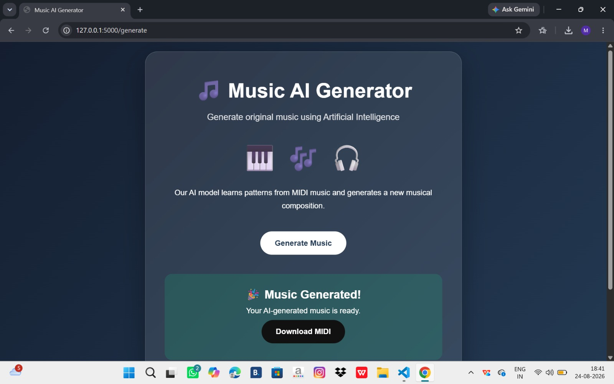

# 🎵 Music AI Generator

An AI-powered web application that generates new music compositions using Artificial Intelligence and Deep Learning.

## 🖼️ Project Preview

## ✨ Features

- 🎵 AI-based music generation
- 🤖 Deep Learning-based music prediction
- 🎹 MIDI music generation
- 🌐 Interactive Flask web interface
- ⚡ Automatic music generation
- ⬇️ Download generated MIDI files

## 🛠️ Technologies Used

- Python 3.11
- TensorFlow
- Keras
- Flask
- Music21
- NumPy
- HTML
- CSS
- JavaScript
- MIDI